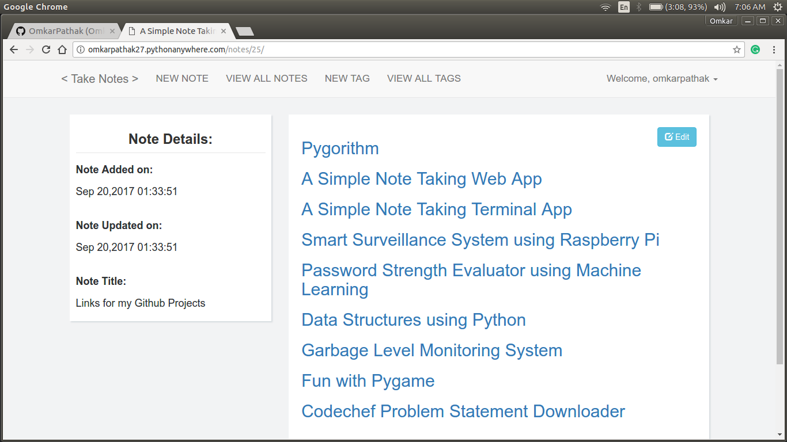
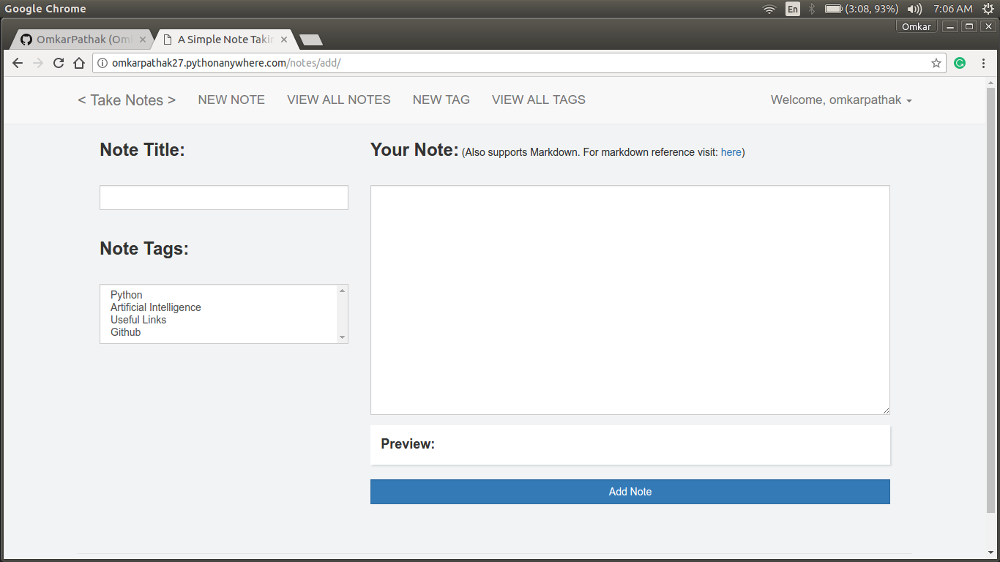
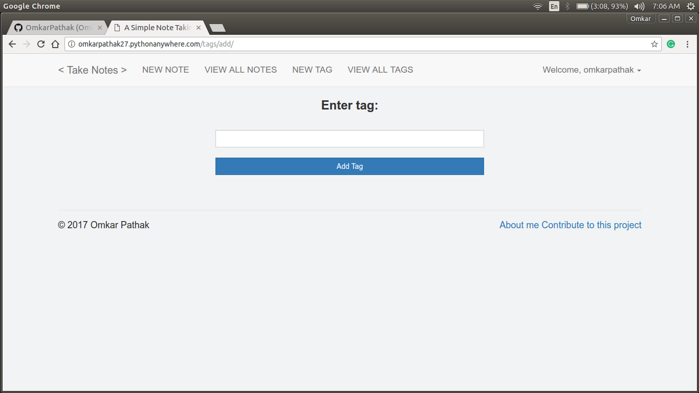
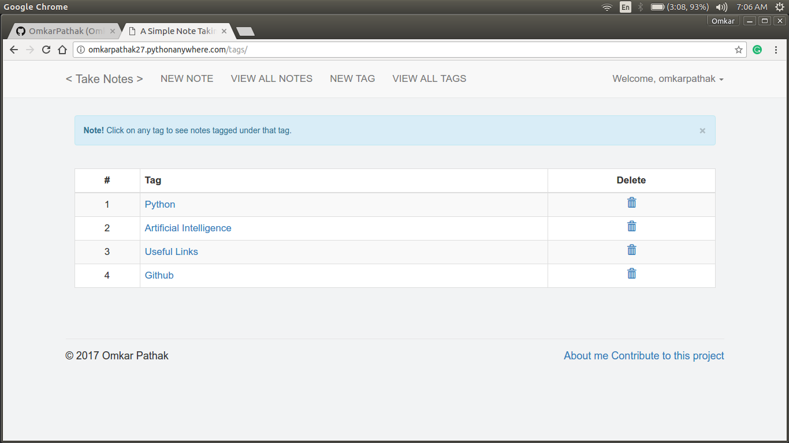
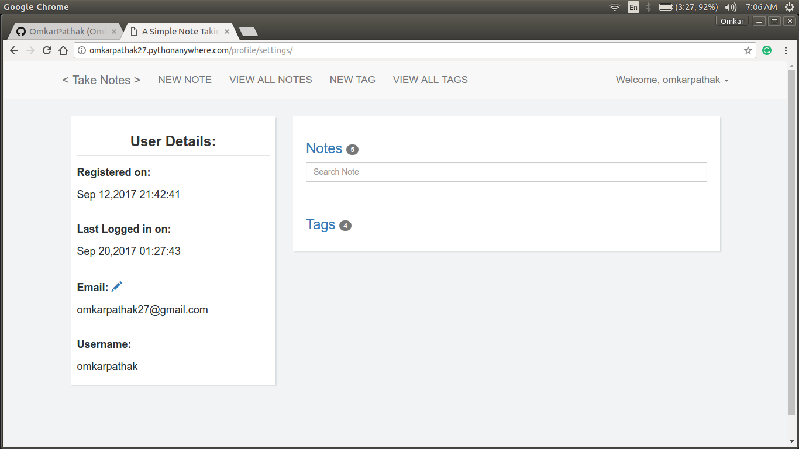

# Notekeeper
An open source web application built using Python and Flask, integrating build and deploy workflows through GitHub actions.

## Table of Contents
* [General Information](#general-information)
* [Architecture](#architecture)
* [Features](#features)
* [Technologies Used](#technologies-used)
* [Requirements](#requirements)
* [Usage](#usage)
* [Acknowledgements](#acknowledgements)
* [License](#license)

<!-- * [Room for Improvement](#room-for-improvement) -->

## General Information
Notekeeper is built upon [A-Simple-Note-Taking-Web-App by Omkar Pathak](https://github.com/OmkarPathak/A-Simple-Note-Taking-Web-App). This project is a part of Byte Size's Final Project in the Strategio Enterprise Simulator: to create and run a CI/CD pipeline for a web application. The application's [Features](#features) are detailed later on in this document. In addition to those, this repository contains workflows to build and test Python project files, and (if enabled) deploy the web app to an AWS EC2 instance using Terraform Cloud.

## Architecture

### CI/CD Pipeline

### AWS Deployment

## Features

### Creating a new note
Simple interface with live preview and markdown support

### Viewing a note
Edit box provided to simply edit the note

### Adding a tag

### Viewing all tags
You can click on any tag to see all notes tagged under *that* tag

### Profile Settings
Profile settings to see user details, change email and see notes and tags saved by particular user

## Technologies Used

- Python 3.8.14
- Flask 0.12.2
- SQLite
- Pytest
- Terraform Cloud*
- AWS EC2*

*(\* optional)*

## Requirements:

- Python 3.8.14 (other versions may break dependencies)
- pip3
- Required third party libraries from `requirements.txt`

To install pip3, ensure your package manager is up to date. 

    # either
    apt-get update -y
    # or
    yum update -y

Then, grab the python3-pip package.

    # either
    apt-get -y install python3-pip
    # or
    yum install python3-pip -y

## Usage:

Clone this repository:

    git clone https://github.com/strategio-tech/fp-sim4-byte-size.git

Change into the cloned directory and install the dependencies:

    cd fp-sim4-byte-size
    pip3 install -r requirements.txt

Run this command to start the app:

    python3 manage.py

Visit `localhost:5000` or `0.0.0.0:5000` in your web browser, and voilà!

## Acknowledgements

This project was inspired by and built upon [A-Simple-Note-Taking-Web-App by Omkar Pathak](https://github.com/OmkarPathak/A-Simple-Note-Taking-Web-App).

## [License](LICENSE)
