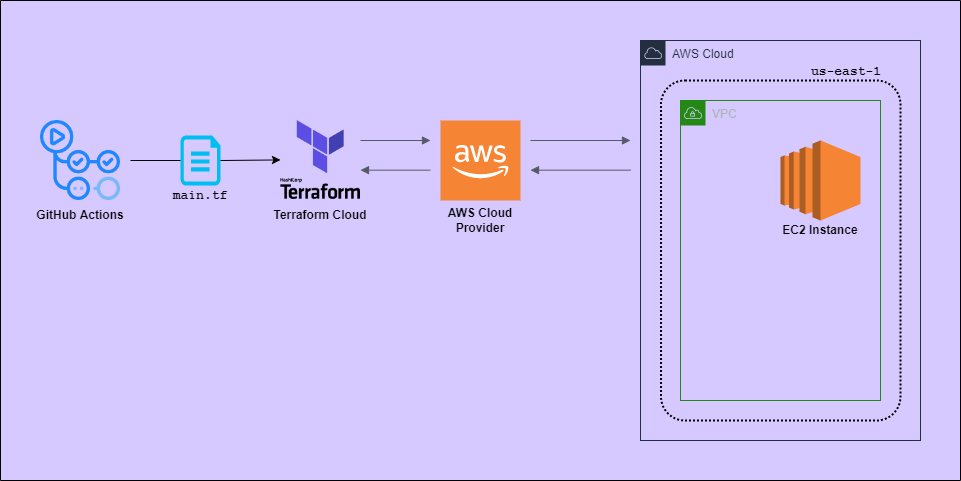

# Notekeeper
An open source web application built using Python and Flask, integrating build and deploy workflows through GitHub actions.

## Table of Contents
* [General Information](#general-information)
* [Architecture](#architecture)
* [Features](#features)
* [Technologies Used](#technologies-used)
* [Requirements](#requirements)
* [Usage](#usage)
* [Acknowledgements](#acknowledgements)
* [License](#license)

<!-- * [Room for Improvement](#room-for-improvement) -->

## General Information
Notekeeper is built upon [A-Simple-Note-Taking-Web-App by Omkar Pathak](https://github.com/OmkarPathak/A-Simple-Note-Taking-Web-App). This project is a part of Byte Size's Final Project in the Strategio Enterprise Simulator: to create and run a CI/CD pipeline for a web application. The application's [Features](#features) are detailed later on in this document. In addition to those, this repository contains workflows to build and test Python project files, and (if enabled) deploy the web app to an AWS EC2 instance using Terraform Cloud.

## Architecture

### CI/CD Pipeline

### AWS Deployment

## Features

### Adding a new note
Markdown supported entry field, live preview, entry for note title, and tag(s) selection field.

### Viewing a note
See note detail and contents, with options to edit or delete the note.

### Viewing all notes
See a list of all notes stored.

### Searching notes
Search for keywords in note titles to filter results.

### Adding a tag

### Viewing all tags
See a list of all the created tags.

### Viewing tagged notes
See a list of all notes tagged with a specific tag.

### Profile Settings
Profile settings page, which displays details about the user, an editable user email field, and links to the pages that show all notes and tags stored on the account. Another search bar for the notes appears here for convenience.

## Technologies Used

- Python 3.8.14
- Flask 0.12.2
- SQLite
- Pytest
- Terraform Cloud*
- AWS EC2*

*(\* optional)*

## Requirements:

- Python 3.8.14 (other versions may break dependencies)
- pip3
- .flaskenv
- Required third party libraries from `requirements.txt`

To install pip3, ensure your package manager is up to date. 

    # either
    apt-get update -y
    # or
    yum update -y

Then, grab the python3-pip package.

    # either
    apt-get -y install python3-pip
    # or
    yum install python3-pip -y

An example .flaskenv is provided: `.flaskenv.example`. Configure it to your specifications, then create a copy of it named `.flaskenv` that the application can refer to. If you have no additional configurations to specify, simply copy the provided example.

    cp .flaskenv.example .flaskenv  

## Usage:

Clone this repository:

    git clone https://github.com/strategio-tech/fp-sim4-byte-size.git

Change into the cloned directory and install the dependencies:

    cd fp-sim4-byte-size
    pip3 install -r requirements.txt

Run this command to start the app:

    python3 manage.py

Visit `localhost:5000` or `0.0.0.0:5000` in your web browser, and voilà!

## Acknowledgements

This project was inspired by and built upon [A-Simple-Note-Taking-Web-App by Omkar Pathak](https://github.com/OmkarPathak/A-Simple-Note-Taking-Web-App).

## [License](LICENSE)
